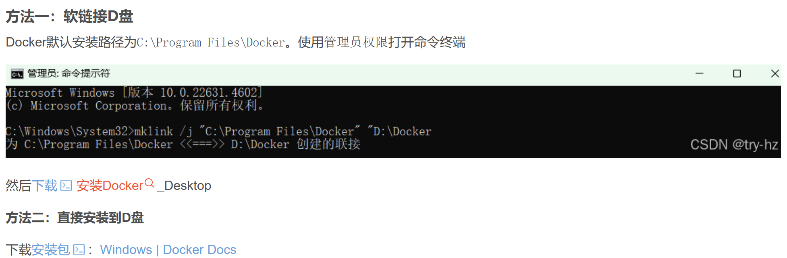

# Docker部署
## 1.安装DockerDesktop
https://blog.csdn.net/weixin_45145684/article/details/144729149


## 2.创建.venv环境
退出当前项目所在的conda环境,切到新建的.venv环境
①下载pipreqs库，使用以下命令 pip install pipreqs \
②使用以下命令生成requirements.txt文件 pipreqs . --encoding=utf8 --force \
③生成的requirements.txt文件如下，不会出现所有的python库包 \
④下载requirements.txt的所有库包的方法命令如下 \
```bash
pip install -r requirements.txt -i https://pypi.tuna.tsinghua.edu.cn/simple
```
### 生成requirements.txt文件
https://blog.csdn.net/qq_53644346/article/details/138506229?ops_request_misc=%257B%2522request%255Fid%2522%253A%2522ea8290e3d18c717a0d2847d9d4cd4798%2522%252C%2522scm%2522%253A%252220140713.130102334..%2522%257D&request_id=ea8290e3d18c717a0d2847d9d4cd4798&biz_id=0&utm_medium=distribute.pc_search_result.none-task-blog-2~all~top_positive~default-1-138506229-null-null.142%5Ev102%5Epc_search_result_base7&utm_term=%E7%94%9F%E6%88%90requirements.txt%E6%96%87%E4%BB%B6&spm=1018.2226.3001.4187 \
方法3（推荐）\
前两种方法适用于将解释器中的所有安装包写入requirements.txt文件中，但是如果需要保存本项目中使用过的安装包时（尤其是生成自己python代码所使用的安装包），则按照以下步骤进行：\
在Anaconda Prompt中，首先安装pipreqs，\
**python**
```bash
pip install pipreqs
```
然后进入到你所在的项目根目录，运行以下命令：
**shell**
```bash
pipreqs ./ --encoding=utf-8
```
### 报错:UnicodeDecodeError: 'utf-8' codec can't decode byte 0xb1 in position 81: invalid start byte
请参数解决方案:https://blog.csdn.net/weixin_41934979/article/details/139256562?ops_request_misc=%257B%2522request%255Fid%2522%253A%25220c1fe91e4788ee754031bce02906e8cc%2522%252C%2522scm%2522%253A%252220140713.130102334.pc%255Fall.%2522%257D&request_id=0c1fe91e4788ee754031bce02906e8cc&biz_id=0&utm_medium=distribute.pc_search_result.none-task-blog-2~all~first_rank_ecpm_v1~rank_v31_ecpm-1-139256562-null-null.142^v102^pc_search_result_base7&utm_term=%E4%BD%BF%E7%94%A8%20pipreqs%20.%2F%20--encoding%3Dutf-8%E6%97%B6UnicodeDecodeError%3A%20utf-8%20codec%20cant%20decode%20byte%200xb1%20in%20position%2081%3A%20invalid%20start%20byte&spm=1018.2226.3001.4187 
```bash
pipreqs --ignore .venv --force
```
--ignore: 忽略执行 \
--force : 强制覆盖requirements.txt的内容

❗❗❗确保在.venv程序能跑通✅

## 3.编写Dockerfile(核心配置文件)
Dockerfile 是 “说明书”，告诉 Docker 如何打包你的项目(比如基础环境、安装依赖、启动命令)。 \
在你的项目根目录（和 requirements.txt 同级）新建 Dockerfile 文件，内容示例：
```bash
# 1. 选择基础 Python 环境（选和你项目匹配的版本，比如 3.9）
FROM python:3.9-slim

# 2. 设置工作目录（容器内的文件夹，类似你本地的项目目录）
WORKDIR /app

# 3. 复制项目文件到容器内（本地的 requirements.txt 和 src 文件夹，复制到容器的 /app 下）
COPY requirements.txt .
COPY src/ ./src/

# 4. 安装依赖（用清华源加速，避免网络问题）
RUN pip install --no-cache-dir -r requirements.txt -i https://pypi.tuna.tsinghua.edu.cn/simple

# 5. 设置容器启动命令（启动你的项目，和本地执行的命令一致）
CMD ["python", "src/main.py", "app"]
```
## 4.构建镜像
镜像是 “打包好的环境包”，包含 Python、依赖包、你的项目代码。 \
启动Docker Desktop \
🟣🟢🟡可以先把基础镜像给pull下来再构建
```bash
docker pull python:3.12-slim
```

在终端进入项目根目录（确保和 Dockerfile 同级），执行构建命令：
```bash
# 格式：docker build -t 镜像名:版本号 . （末尾的 . 表示“从当前目录的 Dockerfile 构建”）
docker build -t medical_assistant:v1.0 .
```
- 执行后会看到 “Step 1/5 : FROM python:3.9-slim” 等日志，等待构建完成（首次会下载基础镜像，可能慢一点）。\
- 构建成功后，用 docker images 命令能看到你刚创建的 medical-assistant:v1.0 镜像。

## 5.创建并运行Docker容器
容器是 “镜像的运行实例”，相当于启动一个独立的 “小电脑” 跑你的项目。\
执行创建容器的命令：
```bash
# 格式：docker run -d --name 容器名 镜像名:版本号 （-d 表示“后台运行”）
#docker run -d --name med-assist-container medical-assistant:v1.0
#docker run -d --name medical_container --add-host="host.docker.internal:host-gateway" medical_assistant:v1.0
docker run -d --name medical_container --add-host="host.docker.internal:host-gateway" -p 8000:8000 medical_assistant:v1.0
```
- **-p 8000:8000** 表示 “宿主机的 8000 端口 ↔ 容器内的 8000 端口”，如果宿主机 8000 端口被占用，可改宿主机端口（比如 -p 8888:8000，后续访问用 8888 端口）。
- 运行后用 docker ps 命令能看到 medical_container 容器处于 “Up” 状态，说明项目正在容器内运行。
- 如果需要查看容器内的日志（比如调试报错），执行：
```bash
docker logs medical_container
```


